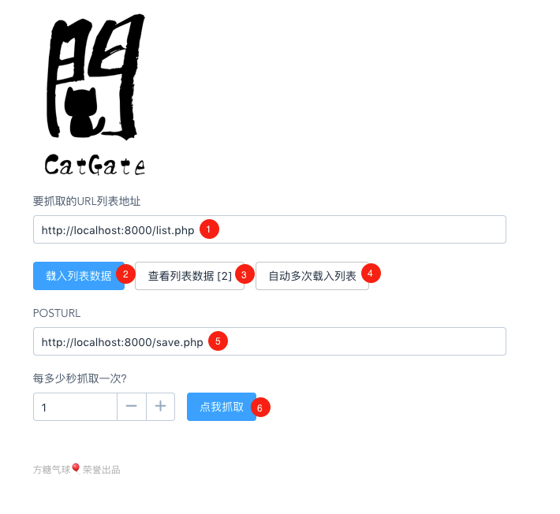

# CatGate

CatGate 是一个基于浏览器插件的数据抓取工具。做成浏览器插件无需模拟登入，能最真实的模仿用户行为和特征。

## 演示视频

http://weibo.com/1088413295/F9P1izhY2

## 功能

- ① CatGate 会访问这个URL，这个URL应该返回一个Json格式的数组，每一个元素一个字符串（即网址）。点 ② 按钮即可载入数据，并可按 ③ 进行查看，会自动排重。
- ⑤ CatGate 抓取到数据后，会直接 POST 给这个URL，key 为 content , 通过 $_REQUEST['content'] 即可获取抓取内容。

- ⑥ 默认一秒抓取一次，如果抓取失败太多，可以增加秒数。

- ④ 这是一个高级用法，就是 ① 这个 URL 可以不停的新增 URL，CatGate 会自动每隔一秒（可设置）去抓取并合并进来。

## Demo

进入 `php` 目录，运行 `php -S localhost:8000` 即可测试。

- list.php 这个页面生成了要抓取的页面列表，默认是微博收藏的页面。
- save.php 这个页面定义了如何处置抓到的数据，默认是保持成为文件。

## 安装插件

如果你不想或不能在Chrome商店安装插件，可手工安装。

chrome > extentsion > load unpacked extension > ./ext

# License

CC，保留签名、非商用。

